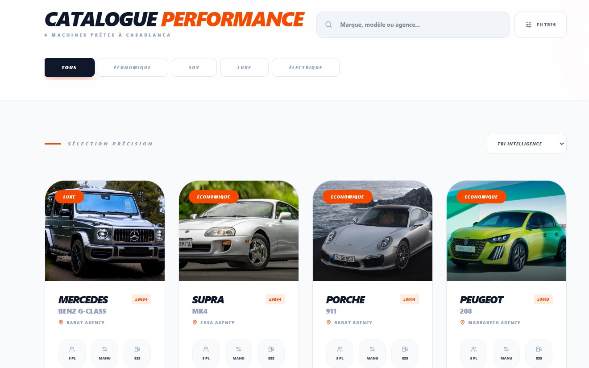

<div align="center">


# 🚗 CARRENTAL — Plateforme de Location de Voitures

**Application web full-stack multi-rôles pour la gestion complète de location de véhicules**

[](https://react.dev)
[](https://laravel.com)
[](https://tailwindcss.com)
[](https://mysql.com)
[](https://ai.google.dev)

</div>

---

## À propos du projet

**CARRENTAL** est une plateforme web complète développée dans le cadre d'un **Projet Fin d'Études (PFE)**. Elle permet la gestion en ligne de la location de voitures avec un système multi-rôles couvrant l'ensemble du cycle : catalogue, réservation, gestion de flotte et supervision administrative.

---

## Fonctionnalités par rôle

### Guest
- Naviguer sur la landing page (mode clair / sombre)
- Parcourir le catalogue de voitures avec filtres avancés
- Consulter le détail d'un véhicule
- Redirigé vers la connexion pour toute action (réservation, panier)

### Client
- Inscription & connexion sécurisée
- Ajouter des voitures au panier et effectuer des réservations
- Sélectionner les dates et calculer le prix automatiquement
- Suivre l'historique des réservations avec statuts
- Télécharger le **contrat de réservation en PDF**
- Accéder au **chatbot IA** (Gemini) pour assistance

### Agence
- Dashboard analytique (revenus, réservations, graphiques)
- Gestion complète du parc de véhicules (CRUD + upload photos)
- Consultation et filtrage des réservations
- Gestion du profil agence

### Admin
- Vue globale de la plateforme (Control Center)
- Gestion de tous les comptes (clients & agences)
- **Validation / Rejet** des nouvelles agences
- Gestion de toutes les voitures de la plateforme
- Notifications en temps réel pour comptes en attente

---

## Stack Technique

| Couche | Technologies |
|--------|-------------|
| **Frontend** | React 18, Tailwind CSS, React Router v6, Axios |
| **Backend** | Laravel 10, API REST, Laravel Sanctum (JWT) |
| **Base de données** | MySQL |
| **IA** | Google Gemini API (chatbot) |
| **Stockage** | Cloudinary (images) |
| **PDF** | React-PDF (génération contrats) |

---

## Aperçu

<div align="center">

### Landing Page


---

### Catalogue & Store



---

### Dashboard Agence


---

### Admin Control Center


</div>

---

## Installation locale

### Prérequis
- PHP 8.2, Composer
- Node.js 18, npm
- MySQL

### Backend (Laravel)

```bash
cd backend
composer install
cp .env.example .env
php artisan key:generate
# Configurer DB dans .env
php artisan migrate --seed
php artisan serve
```

### Frontend (React)

```bash
cd frontend
npm install
cp .env.example .env
# Ajouter VITE_API_URL=http://localhost:8000/api
npm run dev
```

### Variables d'environnement requises

```env
# Backend .env
DB_DATABASE=carrental
DB_USERNAME=root
DB_PASSWORD=

GEMINI_API_KEY=your_gemini_key
CLOUDINARY_URL=your_cloudinary_url

# Frontend .env
VITE_API_URL=http://localhost:8000/api
```

---

## Structure du projet

```
Car-rental/
├── backend/                 # Laravel API REST
│   ├── app/
│   │   ├── Http/Controllers/
│   │   ├── Models/
│   ├── database/migrations/
│   └── routes/api.php
│
└── frontend/                # React SPA
    ├── src/
    │   ├── components/
    │   ├── context/
    │   ├── pages/
    │   └── hooks/
    │   └── image/
    │   │   ├── guest/
    │   │   ├── client/
    │   │   ├── agency/
    │   │   └── admin/
```

---

## Auteur

**Aymen Siraj**


<div align="center">

**Projet Fin d'Études — 2025 / 2026**

</div>
